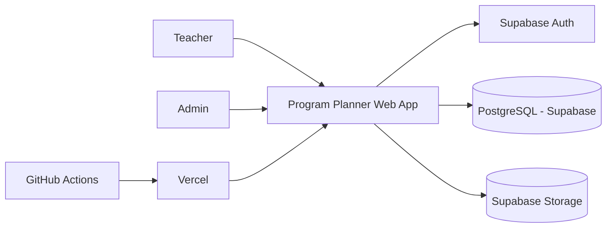
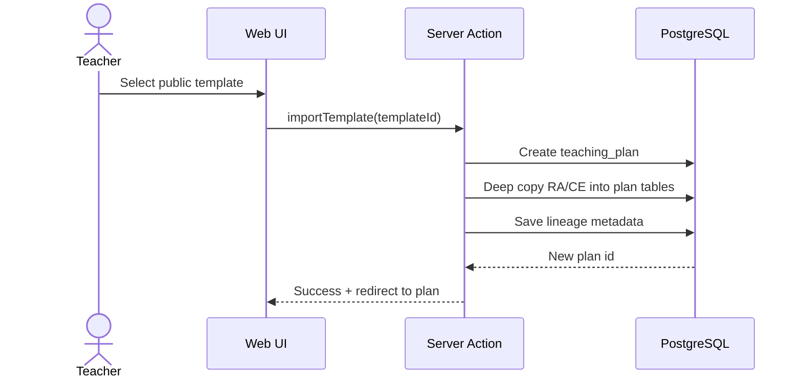
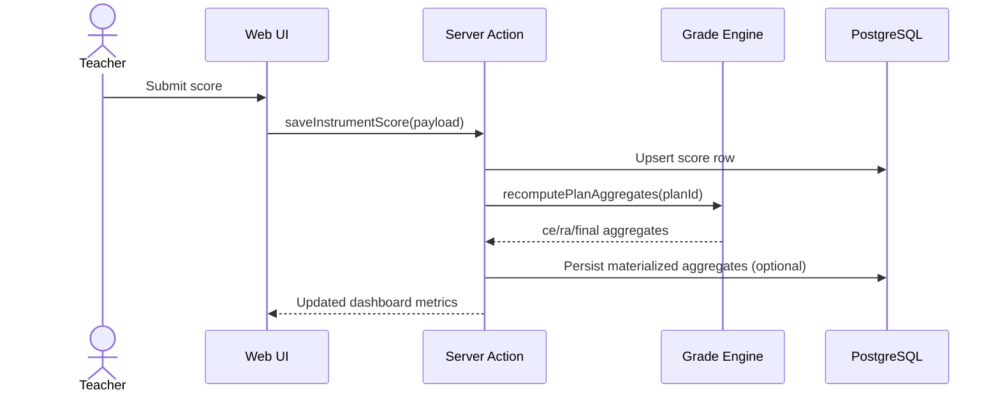

# Program Planner - System Architecture

## 1. Architectural Style
- Framework: Next.js App Router (server-first + client components where needed).
- Backend pattern: Server Actions + Supabase client (no mandatory REST layer).
- Data store: PostgreSQL (Supabase).
- AuthZ: Supabase Auth + Row Level Security (RLS).
- Testing focus: domain calculation engine and validation rules.

## 2. Logical Modules
- `auth`: sign-up, sign-in, session, role resolution.
- `curriculum`: public templates by region/year/module.
- `teaching-plan`: private teacher copies + planning entities.
- `evaluation`: instruments, CE coverage, grading, aggregates.
- `collaboration`: publish/import (fork), lineage tracking.
- `admin`: user role management and moderation.

## 3. Context Diagram


## 4. Data Model (ERD)
```mermaid
erDiagram
    PROFILE ||--o{ TEACHING_PLAN : owns
    PROFILE ||--o{ CURRICULUM_TEMPLATE : authors
    CURRICULUM_TEMPLATE ||--o{ TEMPLATE_RA : contains
    TEMPLATE_RA ||--o{ TEMPLATE_CE : contains

    TEACHING_PLAN ||--o{ PLAN_RA : contains
    PLAN_RA ||--o{ PLAN_CE : contains

    TEACHING_PLAN ||--o{ DIDACTIC_UNIT : includes
    DIDACTIC_UNIT }o--o{ PLAN_CE : covers

    TEACHING_PLAN ||--o{ EVALUATION_INSTRUMENT : defines
    EVALUATION_INSTRUMENT ||--o{ INSTRUMENT_CE_WEIGHT : maps
    PLAN_CE ||--o{ INSTRUMENT_CE_WEIGHT : weighted_by

    EVALUATION_INSTRUMENT ||--o{ INSTRUMENT_SCORE : records
    PLAN_CE ||--o{ INSTRUMENT_SCORE : graded_for

    TEACHING_PLAN }o--|| TEACHING_PLAN : cloned_from

    PROFILE {
        uuid id PK
        string email UNIQUE
        string role "teacher|admin"
        string full_name
        timestamptz created_at
    }

    CURRICULUM_TEMPLATE {
        uuid id PK
        uuid author_id FK
        string region_code
        string module_code
        string module_name
        string academic_year
        string study_level
        string template_version
        string source_type "manual|pdf_assisted"
        boolean is_public
        timestamptz created_at
    }

    TEMPLATE_RA {
        uuid id PK
        uuid template_id FK
        string code
        text description
        numeric weight_in_template
    }

    TEMPLATE_CE {
        uuid id PK
        uuid template_ra_id FK
        string code
        text description
        numeric weight_in_ra
    }

    TEACHING_PLAN {
        uuid id PK
        uuid owner_id FK
        uuid source_plan_id FK
        uuid source_template_id FK
        string title
        string region_code
        string academic_year
        boolean is_public
        string status "draft|ready|published|archived"
        timestamptz created_at
    }

    PLAN_RA {
        uuid id PK
        uuid plan_id FK
        string code
        text description
        numeric weight_in_plan
    }

    PLAN_CE {
        uuid id PK
        uuid plan_ra_id FK
        string code
        text description
        numeric weight_in_ra
    }

    DIDACTIC_UNIT {
        uuid id PK
        uuid plan_id FK
        string code
        string title
        text description
        string trimester "T1|T2|T3"
        int display_order
    }

    EVALUATION_INSTRUMENT {
        uuid id PK
        uuid plan_id FK
        string type
        string title
        text description
        string grading_mode "simple|advanced"
        timestamptz created_at
    }

    INSTRUMENT_CE_WEIGHT {
        uuid id PK
        uuid instrument_id FK
        uuid plan_ce_id FK
        numeric coverage_percent
    }

    INSTRUMENT_SCORE {
        uuid id PK
        uuid instrument_id FK
        uuid plan_ce_id FK
        numeric score_value
        date score_date
        text notes
    }
```

## 5. Key Flows

### 5.1 Import Public Curriculum into New Plan


### 5.2 Save Instrument Grade and Recalculate


## 6. Security Model
- RLS by default deny on all business tables.
- Teacher policy: CRUD own teaching plans and child entities.
- Public read policy: curriculum templates and published plans with `is_public = true`.
- Admin policy: full read/write with explicit role check.

## 7. Deployment Topology
- Vercel hosts Next.js app.
- Supabase hosts Postgres/Auth/Storage.
- GitHub Actions runs lint, typecheck, tests, and optional migration checks.
- Vercel preview deployments for pull requests.

## 8. Critical Non-Functional Requirements
- Predictable grade computations (deterministic, test-covered).
- Fast loading for plans with high CE/UT/instrument volume.
- Auditability for publish/import lineage and important grade mutations.
- Documentation and schema consistency enforced in code review.
