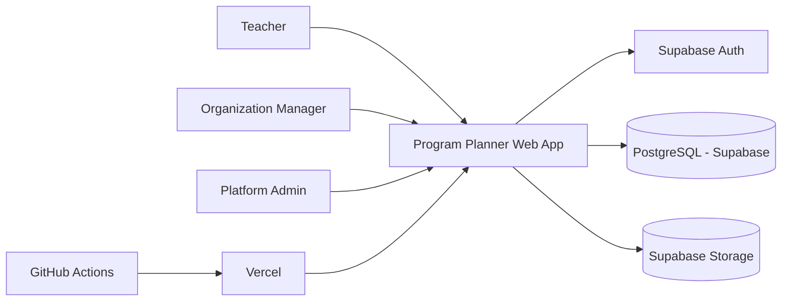
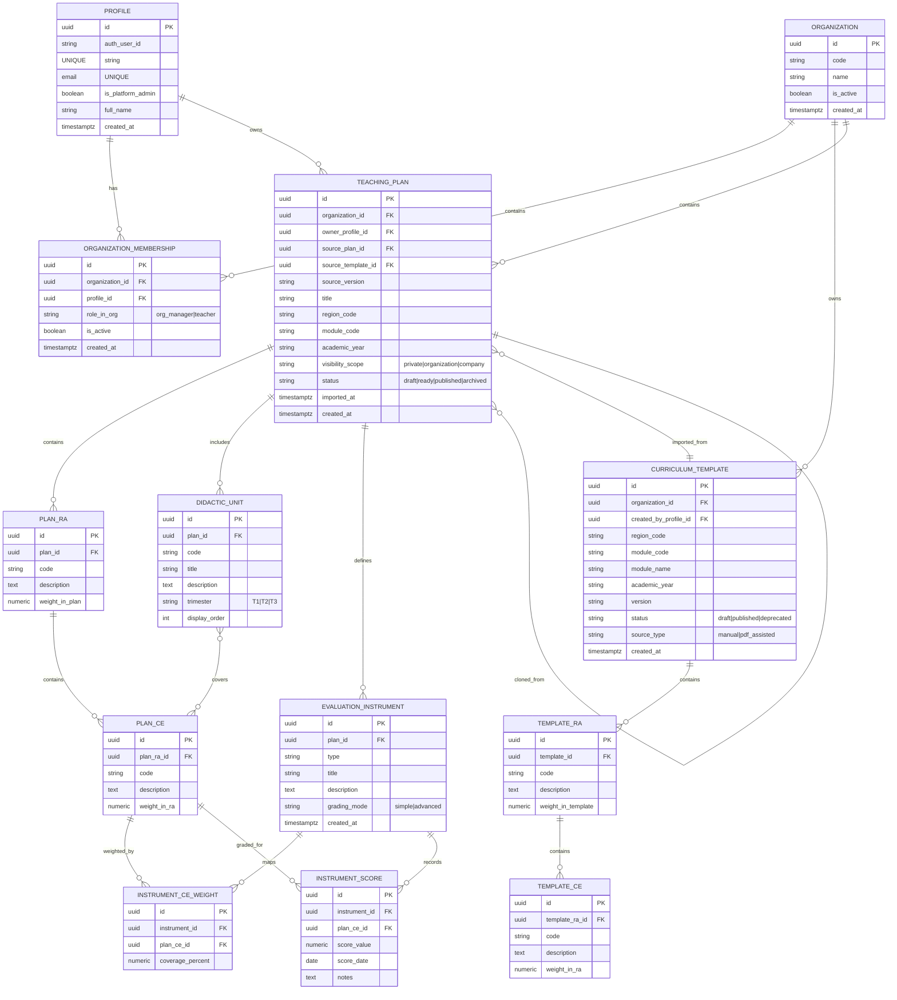
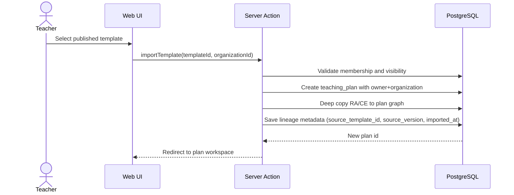
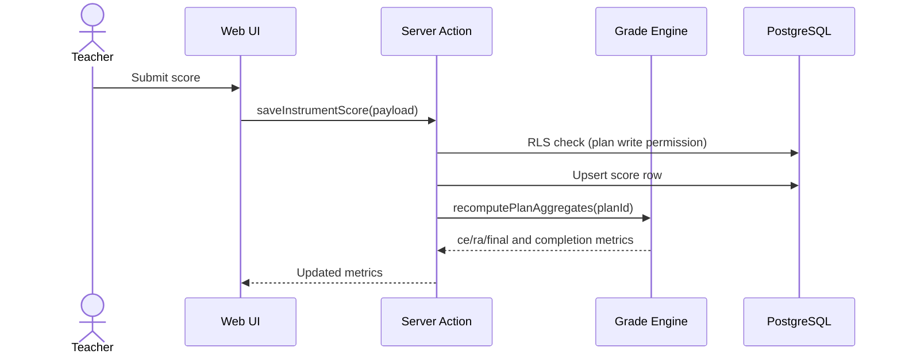

# Program Planner - System Architecture

## 1. Architectural Style
- Framework: Next.js App Router (server-first).
- Backend pattern: Server Actions + Supabase client.
- Data store: PostgreSQL (Supabase) with strict relational integrity.
- AuthN/AuthZ: Supabase Auth + Row Level Security (RLS).
- Security strategy: database-enforced authorization, app checks as secondary layer.

## 2. Logical Modules
- `auth`: sign-up/sign-in/session management.
- `organization`: organization and membership management.
- `curriculum`: versioned curriculum templates by region/module/year.
- `teaching-plan`: teacher-owned planning graph.
- `evaluation`: instrument coverage and grade engine.
- `collaboration`: import/fork and lineage.
- `admin`: cross-organization moderation and support.

## 3. Context Diagram

## 4. Data Model (ERD)

## 5. Authorization and RLS Strategy
RLS is mandatory and default-deny.

Access model:
- `platform_admin`: unrestricted access.
- `org_manager`: full access inside owned organization.
- `teacher`: own plans write access + shared read/import based on `visibility_scope`.

Visibility rules:
- `private`: owner, org managers in same organization, platform admins.
- `organization`: any active membership in same organization.
- `company`: any authenticated active member in any organization.

## 6. Key Flows

### 6.1 Import Template to Teaching Plan

### 6.2 Save Grade and Recompute

## 7. Versioning and Immutability
- Template unique key: `organization_id + region_code + module_code + academic_year + version`.
- `published` templates are immutable.
- Any functional update requires new version row (for example `v2`).

## 8. Deployment Topology
- Vercel hosts Next.js app.
- Supabase hosts Postgres/Auth/Storage.
- GitHub Actions runs lint/typecheck/tests and optional migration checks.
- Branch mapping:
  - `develop` -> development deployment
  - `main` -> production deployment

## 9. Critical Non-Functional Requirements
- Deterministic and test-covered grade calculations.
- Auditable lineage for all imports/forks.
- Predictable performance for high-volume plans.
- Mandatory documentation sync in code review.
