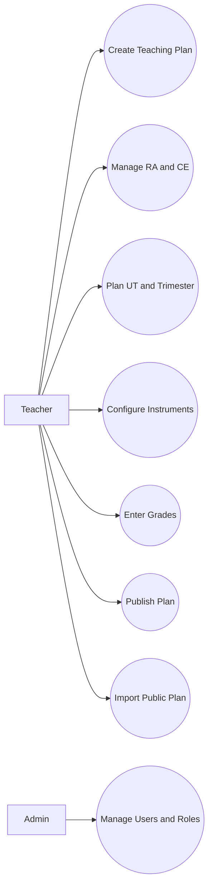
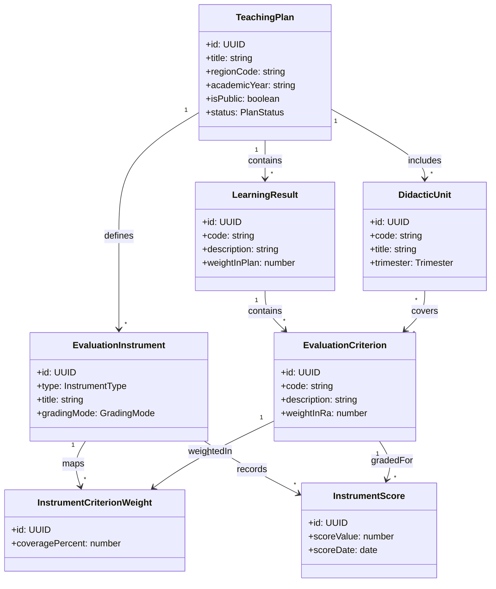
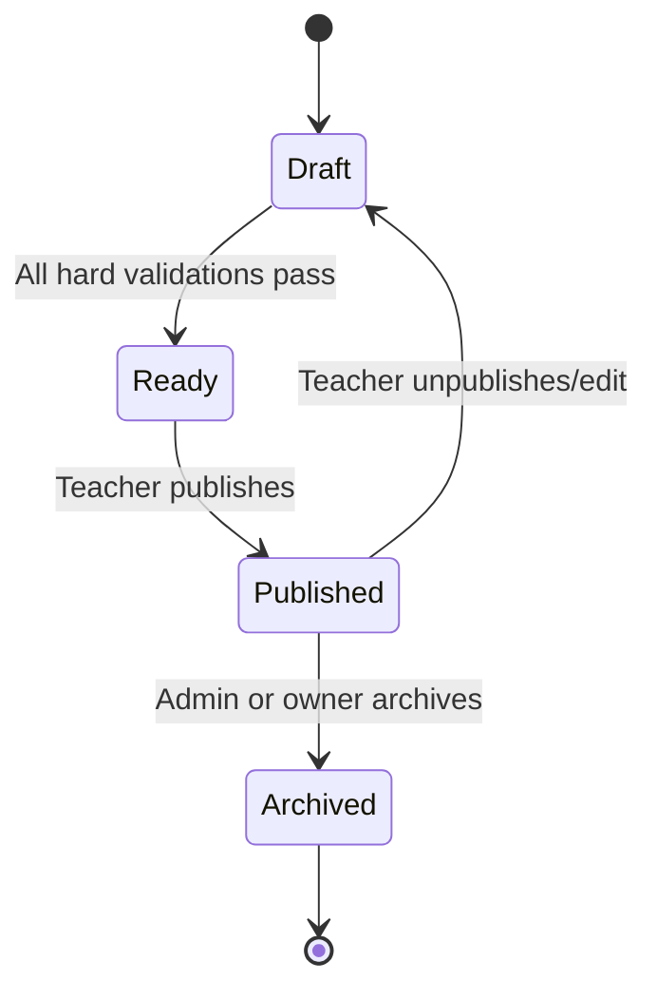

# Program Planner - Additional Diagrams

## 1. Use Case Diagram (High Level)

```mermaid
flowchart LR
    Teacher[Teacher]
    Admin[Admin]

    UC1((Create Teaching Plan))
    UC2((Manage RA and CE))
    UC3((Plan UT and Trimester))
    UC4((Configure Instruments))
    UC5((Enter Grades))
    UC6((Publish Plan))
    UC7((Import Public Plan))
    UC8((Manage Users and Roles))

    Teacher --> UC1
    Teacher --> UC2
    Teacher --> UC3
    Teacher --> UC4
    Teacher --> UC5
    Teacher --> UC6
    Teacher --> UC7
    Admin --> UC8
```

## 2. Domain Class Diagram (Conceptual)

```mermaid
classDiagram
    class TeachingPlan {
      +id: UUID
      +title: string
      +regionCode: string
      +academicYear: string
      +isPublic: boolean
      +status: PlanStatus
    }

    class LearningResult {
      +id: UUID
      +code: string
      +description: string
      +weightInPlan: number
    }

    class EvaluationCriterion {
      +id: UUID
      +code: string
      +description: string
      +weightInRa: number
    }

    class DidacticUnit {
      +id: UUID
      +code: string
      +title: string
      +trimester: Trimester
    }

    class EvaluationInstrument {
      +id: UUID
      +type: InstrumentType
      +title: string
      +gradingMode: GradingMode
    }

    class InstrumentCriterionWeight {
      +id: UUID
      +coveragePercent: number
    }

    class InstrumentScore {
      +id: UUID
      +scoreValue: number
      +scoreDate: date
    }

    TeachingPlan "1" --> "*" LearningResult : contains
    LearningResult "1" --> "*" EvaluationCriterion : contains
    TeachingPlan "1" --> "*" DidacticUnit : includes
    DidacticUnit "*" --> "*" EvaluationCriterion : covers
    TeachingPlan "1" --> "*" EvaluationInstrument : defines
    EvaluationInstrument "1" --> "*" InstrumentCriterionWeight : maps
    EvaluationCriterion "1" --> "*" InstrumentCriterionWeight : weightedIn
    EvaluationInstrument "1" --> "*" InstrumentScore : records
    EvaluationCriterion "1" --> "*" InstrumentScore : gradedFor
```

## 3. Teaching Plan State Diagram

```mermaid
stateDiagram-v2
    [*] --> Draft
    Draft --> Ready: All hard validations pass
    Ready --> Published: Teacher publishes
    Published --> Draft: Teacher unpublishes/edit
    Published --> Archived: Admin or owner archives
    Archived --> [*]
```
