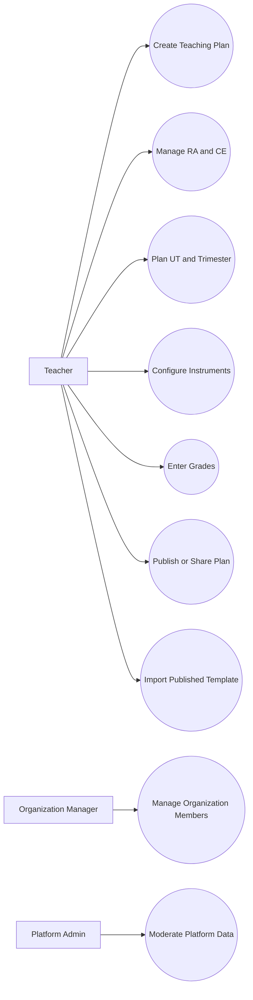
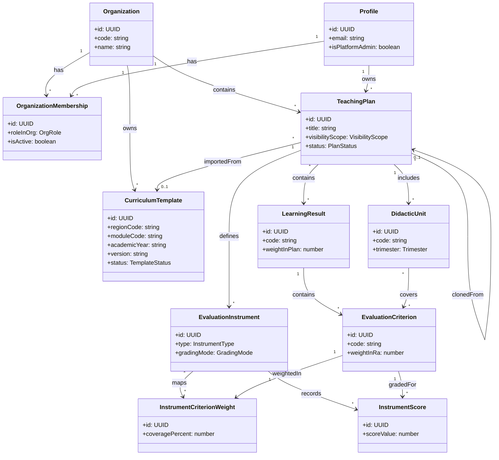
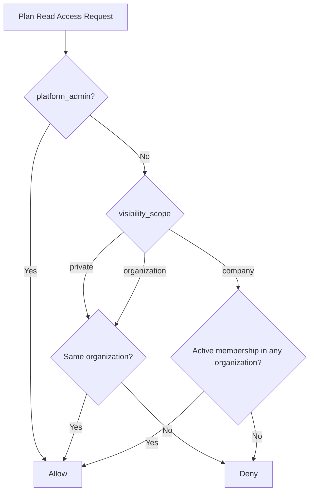
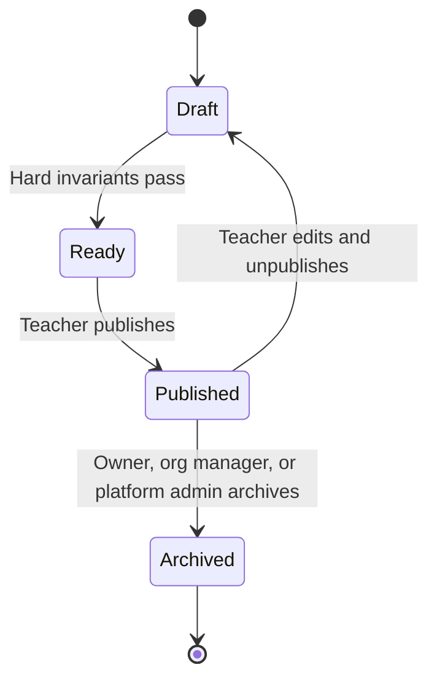

# Program Planner - Additional Diagrams

## 1. Use Case Diagram (High Level)

```mermaid
flowchart LR
    Teacher[Teacher]
    OrgManager[Organization Manager]
    PlatformAdmin[Platform Admin]

    UC1((Create Teaching Plan))
    UC2((Manage RA and CE))
    UC3((Plan UT and Trimester))
    UC4((Configure Instruments))
    UC5((Enter Grades))
    UC6((Publish or Share Plan))
    UC7((Import Published Template))
    UC8((Manage Organization Members))
    UC9((Moderate Platform Data))

    Teacher --> UC1
    Teacher --> UC2
    Teacher --> UC3
    Teacher --> UC4
    Teacher --> UC5
    Teacher --> UC6
    Teacher --> UC7
    OrgManager --> UC8
    PlatformAdmin --> UC9
```

## 2. Domain Class Diagram (Conceptual)

```mermaid
classDiagram
    class Organization {
      +id: UUID
      +code: string
      +name: string
    }

    class Profile {
      +id: UUID
      +email: string
      +isPlatformAdmin: boolean
    }

    class OrganizationMembership {
      +id: UUID
      +roleInOrg: OrgRole
      +isActive: boolean
    }

    class CurriculumTemplate {
      +id: UUID
      +regionCode: string
      +moduleCode: string
      +academicYear: string
      +version: string
      +status: TemplateStatus
    }

    class TeachingPlan {
      +id: UUID
      +title: string
      +visibilityScope: VisibilityScope
      +status: PlanStatus
    }

    class LearningResult {
      +id: UUID
      +code: string
      +weightInPlan: number
    }

    class EvaluationCriterion {
      +id: UUID
      +code: string
      +weightInRa: number
    }

    class DidacticUnit {
      +id: UUID
      +code: string
      +trimester: Trimester
    }

    class EvaluationInstrument {
      +id: UUID
      +type: InstrumentType
      +gradingMode: GradingMode
    }

    class InstrumentCriterionWeight {
      +id: UUID
      +coveragePercent: number
    }

    class InstrumentScore {
      +id: UUID
      +scoreValue: number
    }

    Organization "1" --> "*" OrganizationMembership : has
    Profile "1" --> "*" OrganizationMembership : has
    Organization "1" --> "*" CurriculumTemplate : owns
    Organization "1" --> "*" TeachingPlan : contains
    Profile "1" --> "*" TeachingPlan : owns
    TeachingPlan "1" --> "*" LearningResult : contains
    LearningResult "1" --> "*" EvaluationCriterion : contains
    TeachingPlan "1" --> "*" DidacticUnit : includes
    DidacticUnit "*" --> "*" EvaluationCriterion : covers
    TeachingPlan "1" --> "*" EvaluationInstrument : defines
    EvaluationInstrument "1" --> "*" InstrumentCriterionWeight : maps
    EvaluationCriterion "1" --> "*" InstrumentCriterionWeight : weightedIn
    EvaluationInstrument "1" --> "*" InstrumentScore : records
    EvaluationCriterion "1" --> "*" InstrumentScore : gradedFor
    TeachingPlan "*" --> "0..1" CurriculumTemplate : importedFrom
    TeachingPlan "*" --> "0..1" TeachingPlan : clonedFrom
```

## 3. Visibility Decision Diagram

```mermaid
flowchart TD
    Start[Plan Read Access Request]
    IsAdmin{platform_admin?}
    SameOrg{Same organization?}
    Scope{visibility_scope}
    AnyMember{Active membership in any organization?}
    Allow[Allow]
    Deny[Deny]

    Start --> IsAdmin
    IsAdmin -- Yes --> Allow
    IsAdmin -- No --> Scope

    Scope -- private --> SameOrg
    SameOrg -- Yes --> Allow
    SameOrg -- No --> Deny

    Scope -- organization --> SameOrg
    Scope -- company --> AnyMember
    AnyMember -- Yes --> Allow
    AnyMember -- No --> Deny
```

## 4. Teaching Plan State Diagram

```mermaid
stateDiagram-v2
    [*] --> Draft
    Draft --> Ready: Hard invariants pass
    Ready --> Published: Teacher publishes
    Published --> Draft: Teacher edits and unpublishes
    Published --> Archived: Owner, org manager, or platform admin archives
    Archived --> [*]
```
